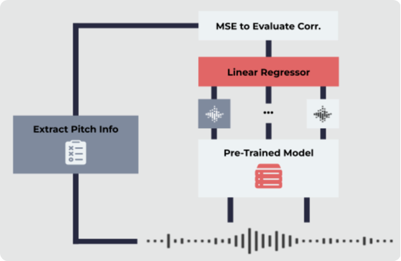

# jsalt

> WORK IN PROGRESS -- Information is in the process of being added

### Introduction

This is some of my work at the [2022 Annual Frederick Jelinek Memorial Summer Workshop](https://www.clsp.jhu.edu/2022-eighth-frederick-jelinek-memorial-summer-workshop/).

This repository highlights a pitch reconstruction task which investigates cross-lingual transfer for large pre-trained models trained only on speech data English data.

Audio data is pulled from the [FLERUS dataset](https://huggingface.co/datasets/google/fleurs), and pitch labels are created using [pYAAPT](http://bjbschmitt.github.io/AMFM_decompy/pYAAPT.html).

### Pitch Reconstruction

Pitch reconstruction starts off with an audio file.

This audio file is then fed into a pre-trained model (ie. HuBERT, Mockingjay, etc). The hiddens states (the model's internal representation of the audio) are then extracted from the ouptput. In this project, this was done using the [S3PRL toolkit](https://github.com/s3prl/s3prl).

Separately, a pitch tracking algorithm (in this case, [pYAAPT](http://bjbschmitt.github.io/AMFM_decompy/pYAAPT.html), others like kaldi can work as well) is used to create "ground truth" pitch information for the audio file (since FLEURS is not labeled for pitch).

A linear regression is then run against the pYAAPT pitch frames and the hidden states of the model, after aligning the frames. Mean Squared Error is calculated, as if the hidden states correlate with the pitch information frame by frame, we can say that the model's internal representation does include some pitch information. 

### Cross-Lingual Transfer in Pitch Reconstruction

Many of pre-trained models are pre-trained only on Enlgish data. This begs the question: how well do these models capture pitch information from other languages? Does learning to represent pitch in one language transfer over to others?

Here, zero-shot multilingual pitch reconstruction is performed using the above method. The results follow:

### Results

TODO

### Methods

#### gather_data.py

Gather data from FLEURS

#### collect_

### Data Examples

TODO
